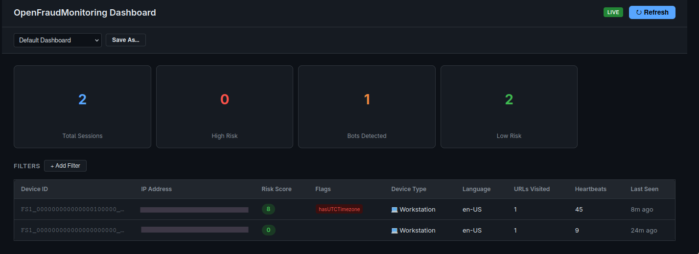
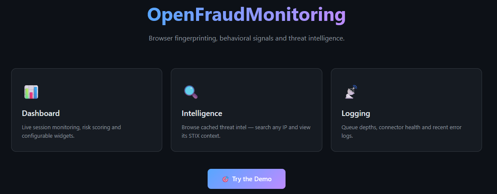
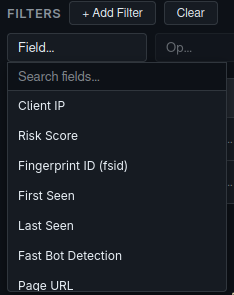
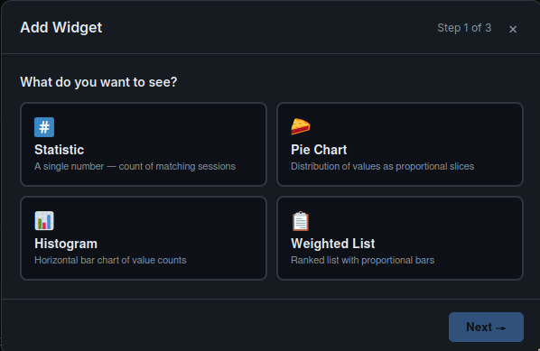
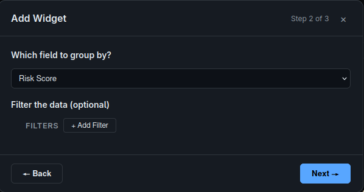
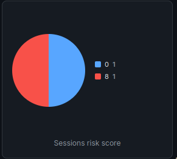
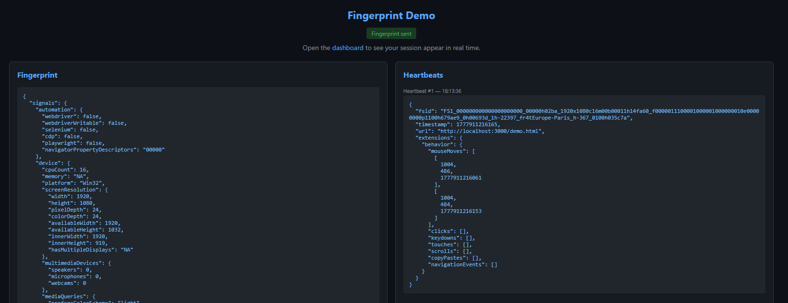
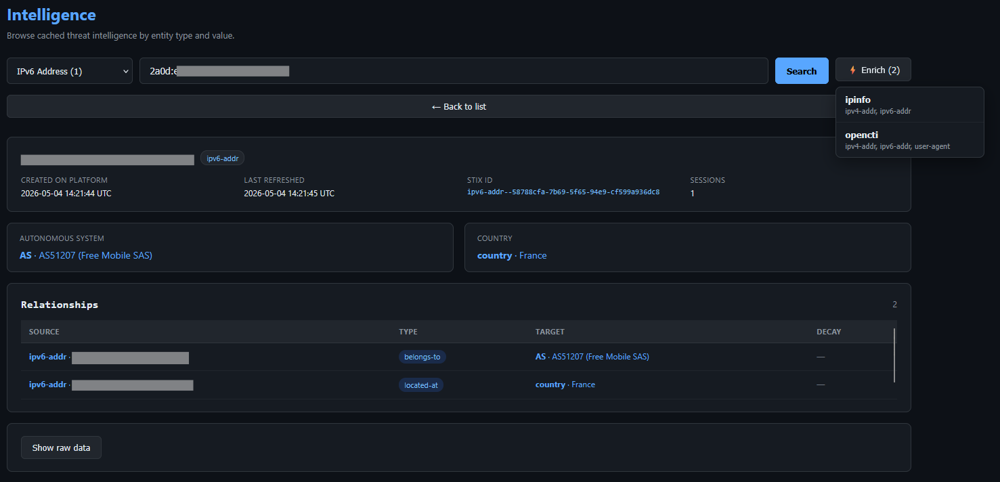
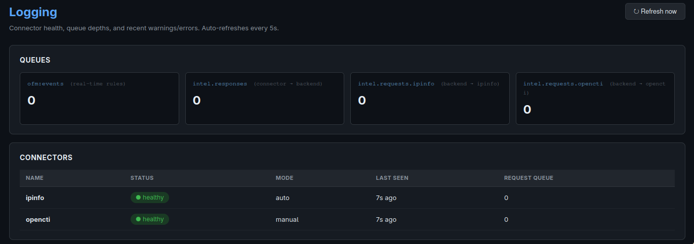

# OpenFraudMonitoring

Self-hosted browser fingerprinting, behavioral analysis, and fraud monitoring platform. One script tag gives you device fingerprints, bot detection, behavioral signals, threat intelligence enrichment, and a live dashboard.



## Features

- **Browser fingerprinting** — collects 35+ signal categories via [FPScanner](fpscanner/) (screen, GPU, codecs, fonts, WebGL, automation flags, etc.)
- **Bot detection** — 21 built-in detection rules (WebDriver, CDP, Selenium, Playwright, spoofed GPU, impossible memory, etc.)
- **Behavioral tracking** — mouse movements, clicks, keystrokes, scrolls, copy/paste, navigation events via heartbeats every 30s
- **Risk scoring** — automatic scoring from bot signals + customizable detection rules
- **Custom dashboards** — drag-and-drop widgets (stats, pie charts, histograms, weighted lists) with saved layouts
- **Session filtering** — 50+ filterable fields with autocomplete, composable filter conditions
- **Threat intelligence** — STIX 2.1 entity store with enrichment connectors (IPinfo, OpenCTI), relationship graph navigation
- **Connector architecture** — pluggable enrichment connectors via RabbitMQ, auto/manual trigger modes, health monitoring

## Quick Start

```bash
cp .env.example .env   # edit if needed
docker compose up --build
```

| Service | URL |
|---------|-----|
| Dashboard | http://localhost:3000 |
| Demo page | http://localhost:3000/demo |
| API | http://localhost:5000 |

## Integration

Add the fingerprint collection script to any page:

```html
<script src="http://your-server/fingerprint.js"></script>
```

The script automatically:
1. Collects a full device fingerprint on page load
2. Sends behavioral heartbeats every 30 seconds
3. Generates a deterministic device ID (`fsid`) that persists across sessions

For cross-origin collection (script on a different domain than the backend), set `OFM_SERVER_URL` in `.env` before building.

## Screenshots

### Landing Page



### Dashboard

The dashboard supports customizable widgets with drag-and-drop layout. Use the filter builder to narrow results by any of 50+ fields.



#### Adding Widgets

Create stat counters, pie charts, histograms, or weighted lists — each with their own filter conditions:

| Step 1: Choose type | Step 2: Configure | Step 3: Result |
|---------------------|-------------------|----------------|
|  |  |  |

### Demo Page

A built-in demo page (`/demo.html`) lets you test fingerprint collection and see the raw signals in real time — no integration needed.



### Intelligence

Browse and search STIX entities (IPs, user agents, AS numbers, malware, indicators). Click any entity to see its relationships, enrichment data, and linked session count. Navigate between related entities directly.



### Logging

Monitor connector health, queue depths, and system logs in real time.



## Configuration

All variables are in [`.env.example`](.env.example). Key ones:

| Variable | Purpose |
|----------|---------|
| `OFM_SERVER_URL` | Remote server URL for the client script (empty = same-origin) |
| `DATABASE_URL` | PostgreSQL connection string |
| `REDIS_URL` | Redis connection string |
| `POSTGRES_PASSWORD` | Database password |
| `CONNECTOR_TOKEN` | Shared auth token for connector HTTP fallback |
| `INTEL_DECAY_DAYS` | Days before STIX intel is marked as decayed (default 7) |

## Documentation

- [Architecture](docs/architecture.md) — system overview, data flow, STIX storage, folder structure
- [Connectors](docs/connectors.md) — how enrichment connectors work, how to build your own
- [Rules](docs/rules.md) — how to create and manage detection rules
- [Filters](docs/filters.md) — how filtering works, schema fields, code mapping

## License

MIT
